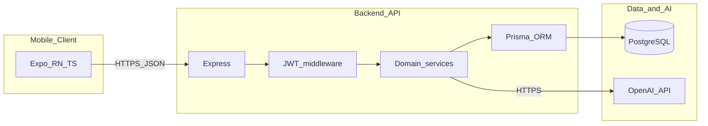
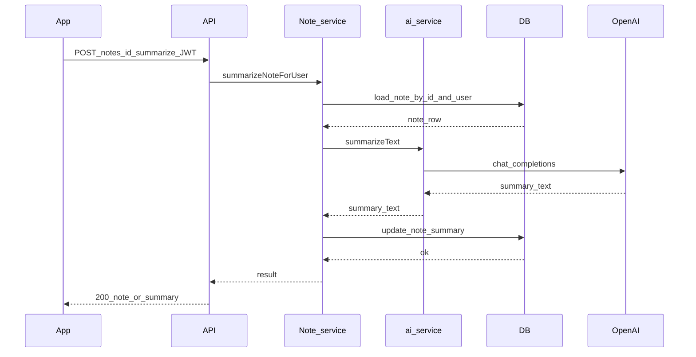

# Clario MVP — Architecture and Planning

## 1. System architecture

**High-level:** A **mobile client** talks to a **stateless REST API** over HTTPS. The API uses **PostgreSQL** for durable data via **Prisma**, and calls **OpenAI** for on-demand note intelligence (summaries, optional future features). **JWT access tokens** (and optionally refresh tokens) authenticate users without server-side sessions.




**Interactions:**


| Component               | Role                                                                                                                                                                    |
| ----------------------- | ----------------------------------------------------------------------------------------------------------------------------------------------------------------------- |
| **Expo app**            | UI, local optimistic updates, secure token storage ([expo-secure-store](https://docs.expo.dev/versions/latest/sdk/securestore/)), API client with Authorization header. |
| **Express**             | Routing, validation, auth middleware, error normalization, rate limiting (recommended for AI routes).                                                                   |
| **Prisma + PostgreSQL** | Single source of truth for users, tasks, notes; migrations in source control.                                                                                           |
| **OpenAI**              | Server-side only; API key never in the app. Request/response logging without storing raw secrets.                                                                       |


**Scalability notes (MVP-ready):** Stateless API allows horizontal scaling behind a load balancer later; DB connection pooling via Prisma; AI calls isolated in `ai.service.ts` so orchestration can evolve later without rewriting routes.

---

## 2. Tech stack justification


| Choice                               | Why it fits Clario MVP                                                                                                             |
| ------------------------------------ | ---------------------------------------------------------------------------------------------------------------------------------- |
| **React Native (Expo) + TypeScript** | One codebase for iOS/Android; Expo accelerates dev/builds; TypeScript catches contract errors against your API types early.        |
| **Node.js + Express**                | Same language as RN tooling ecosystem; Express is minimal and well understood; easy to add middleware (auth, validation, logging). |
| **PostgreSQL**                       | Relational model matches users → tasks/notes; ACID transactions; strong JSON support if you add flexible metadata later.           |
| **Prisma**                           | Schema-first migrations, type-safe queries, reduces SQL boilerplate—good velocity for an MVP with room to grow.                    |
| **JWT**                              | Stateless auth fits mobile + horizontal API scaling; short-lived access tokens limit exposure; pair with secure storage on device. |
| **OpenAI API**                       | Strong general-purpose text models for summarization and future “understand notes” features; keep calls server-side only.          |


---

## 3. Project structure

**Monorepo-style layout (recommended for one team):** `apps/mobile`, `apps/api`, shared optional `packages/shared-types` for DTOs/constants later.

### a. Mobile app (`apps/mobile`)

```
apps/mobile/
  app/                    # Expo Router (file-based routes) OR src/screens if using React Navigation only
  src/
    api/                  # fetch wrappers, base URL, auth header injection
    components/
    hooks/
    screens/              # if not using Expo Router exclusively
    theme/
    types/
    utils/
  assets/
  app.json / app.config.ts
  package.json
  tsconfig.json
```

**Practices:** Feature-oriented folders under `src/` as the app grows; environment via `app.config.ts` + `EXPO_PUBLIC_`* only for non-secret config (API base URL).

### b. Backend (`apps/api`)

```
apps/api/
  prisma/
    schema.prisma
    migrations/
  src/
    config/               # env validation (e.g. zod)
    middleware/           # auth, error handler, request id
    routes/               # thin: wire HTTP to services
    services/             # task.service, note.service, auth.service, ai.service.ts (OpenAI + shared prompts/helpers)
    lib/                  # prisma client singleton, openai client
    types/
    utils/
    index.ts              # app entry, listen
  package.json
  tsconfig.json
```

**Practices:** **Routes stay thin** (parse/validate → call service → map response); **all business logic and OpenAI calls** live in **services** (`ai.service.ts` owns model calls; task/note services own persistence). **Prisma enums** (`TaskStatus`, `Priority`) are the single source of truth—use generated types in Zod/validators. **One Prisma client** per process.

---

## 4. Database design

**Conventions:** UUID primary keys (`uuid`), `timestamptz` for all timestamps, soft deletes optional post-MVP (omit for MVP simplicity unless you need undo).

### `users`


| Column          | Type         | Notes                           |
| --------------- | ------------ | ------------------------------- |
| `id`            | UUID         | PK, default `gen_random_uuid()` |
| `email`         | VARCHAR(255) | UNIQUE, NOT NULL, indexed       |
| `password_hash` | VARCHAR      | NOT NULL (bcrypt/argon2)        |
| `name`          | VARCHAR(255) | nullable                        |
| `created_at`    | TIMESTAMPTZ  | NOT NULL                        |
| `updated_at`    | TIMESTAMPTZ  | NOT NULL                        |


### `tasks`


| Column         | Type                          | Notes                                                                 |
| -------------- | ----------------------------- | --------------------------------------------------------------------- |
| `id`           | UUID                          | PK                                                                    |
| `user_id`      | UUID                          | FK → `users.id` ON DELETE CASCADE                                     |
| `title`        | VARCHAR(500)                  | NOT NULL                                                              |
| `description`  | TEXT                          | nullable                                                              |
| `status`       | `TaskStatus` (DB/Prisma ENUM) | `TODO`, `IN_PROGRESS`, `DONE` — default `TODO`                        |
| `priority`     | `Priority` (DB/Prisma ENUM)   | `LOW`, `MEDIUM`, `HIGH` — default `MEDIUM` (or require on create)     |
| `due_at`       | TIMESTAMPTZ                   | nullable                                                              |
| `completed_at` | TIMESTAMPTZ                   | nullable; set when transitioning to `DONE`, clear if moved off `DONE` |
| `created_at`   | TIMESTAMPTZ                   | NOT NULL                                                              |
| `updated_at`   | TIMESTAMPTZ                   | NOT NULL                                                              |


**Indexes:** `(user_id)`, optionally `(user_id, status)` for filtered lists.

**Prisma enums (schema-level):** Define `enum TaskStatus { TODO IN_PROGRESS DONE }` and `enum Priority { LOW MEDIUM HIGH }`; map `Task.status` and `Task.priority` to these enums so API validation and DB stay aligned.

### `notes`


| Column               | Type         | Notes                                      |
| -------------------- | ------------ | ------------------------------------------ |
| `id`                 | UUID         | PK                                         |
| `user_id`            | UUID         | FK → `users.id` ON DELETE CASCADE          |
| `title`              | VARCHAR(500) | nullable                                   |
| `content`            | TEXT         | NOT NULL (source text for AI)              |
| `summary`            | TEXT         | nullable; last AI summary (optional cache) |
| `summary_model`      | VARCHAR(64)  | nullable; which model produced summary     |
| `summary_updated_at` | TIMESTAMPTZ  | nullable                                   |
| `created_at`         | TIMESTAMPTZ  | NOT NULL                                   |
| `updated_at`         | TIMESTAMPTZ  | NOT NULL                                   |


**Relationships:**

- `User` **1 — N** `Task`
- `User` **1 — N** `Note`

**Prisma:** Model `User` with `tasks Task[]` and `notes Note[]`; enforce `userId` on every task/note row.

### Prisma schema delta (enums + `Task` fields)

```prisma
enum TaskStatus {
  TODO
  IN_PROGRESS
  DONE
}

enum Priority {
  LOW
  MEDIUM
  HIGH
}

model Task {
  // ... id, userId, title, description, dueAt, createdAt, updatedAt
  status       TaskStatus @default(TODO)
  priority     Priority   @default(MEDIUM)
  completedAt  DateTime?  @map("completed_at")
}
```

(Exact column mappings follow your naming strategy: `snake_case` in DB via `@map` if using camelCase in Prisma.)

---

## 5. API design (REST)

**Conventions:** JSON bodies/responses; `401` for missing/invalid JWT; `403` if accessing another user’s resource; `404` when resource missing or not owned (pick one policy and stick to it—often **404** for both “not found” and “not yours” to avoid user enumeration).


| Method   | Route                         | Purpose                                                              | Auth                         |
| -------- | ----------------------------- | -------------------------------------------------------------------- | ---------------------------- |
| `POST`   | `/api/v1/auth/register`       | Create user, return tokens or token                                  | Public                       |
| `POST`   | `/api/v1/auth/login`          | Issue JWT (and optional refresh)                                     | Public                       |
| `POST`   | `/api/v1/auth/refresh`        | Rotate access token (if using refresh)                               | Public (refresh cookie/body) |
| `GET`    | `/api/v1/me`                  | Current user profile                                                 | Protected                    |
| `PATCH`  | `/api/v1/me`                  | Update profile (e.g. name)                                           | Protected                    |
| `GET`    | `/api/v1/tasks`               | List tasks (`page`, `limit`, optional `status`)                      | Protected                    |
| `POST`   | `/api/v1/tasks`               | Create task                                                          | Protected                    |
| `GET`    | `/api/v1/tasks/:id`           | Get one task                                                         | Protected                    |
| `PATCH`  | `/api/v1/tasks/:id`           | Update task                                                          | Protected                    |
| `DELETE` | `/api/v1/tasks/:id`           | Delete task                                                          | Protected                    |
| `GET`    | `/api/v1/notes`               | List notes (`page`, `limit`)                                         | Protected                    |
| `POST`   | `/api/v1/notes`               | Create note                                                          | Protected                    |
| `GET`    | `/api/v1/notes/:id`           | Get one note                                                         | Protected                    |
| `PATCH`  | `/api/v1/notes/:id`           | Update note content/title                                            | Protected                    |
| `DELETE` | `/api/v1/notes/:id`           | Delete note                                                          | Protected                    |
| `POST`   | `/api/v1/notes/:id/summarize` | MVP: load note by id, call shared AI summarize, persist on note      | Protected                    |
| `POST`   | `/api/v1/ai/summarize`        | Future-proof: summarize arbitrary text (body); no note row required  | Protected                    |
| `POST`   | `/api/v1/ai/suggest-tasks`    | Future-proof: propose tasks from text; response may omit persistence | Protected                    |


**AI layering:** `POST /notes/:id/summarize` is implemented in the **note service**, which calls `**ai.service.ts`** (e.g. `summarizeText`). `POST /ai/summarize` and `POST /ai/suggest-tasks` use the same helpers so OpenAI logic stays in one module.

**Pagination (`GET /tasks`, `GET /notes`):**

- **Query:** `page` (1-based), `limit`.
- **Defaults:** `page=1`, `limit=10`; **max `limit`** e.g. 50 (server-enforced).
- **Response:** `{ "data": [...], "meta": { "page": 1, "limit": 10, "total": 42 } }` — `total` respects list filters (e.g. `status` on tasks).

**Health (ops):** `GET /health` — Public, no DB detail in body for production (or split `GET /health/live` vs `/ready` later).

---

## 6. Data flow

### User login

1. App sends `POST /auth/login` with email + password.
2. API validates credentials, compares `password_hash`.
3. API returns **access JWT** (short TTL, e.g. 15m–1h) and optionally **refresh token** (longer TTL, stored hashed in DB if you want revocation—MVP can start with access-only + longer TTL for simplicity).
4. App stores JWT in **SecureStore**; attaches `Authorization: Bearer <token>` to subsequent requests.
5. Middleware verifies signature, expiry, loads `userId` from claims for downstream handlers.

### Creating tasks

1. App `POST /tasks` with JSON body `{ title, status?, priority?, ... }` (enums match Prisma).
2. Auth middleware attaches `userId`.
3. **Task service** creates row with `user_id = userId`; if `status` is `DONE`, set `completed_at` to now; otherwise leave `completed_at` null.
4. App updates local list (or refetches `GET /tasks?page=1&limit=10`).

**Updates:** On `PATCH`, when `status` changes to `DONE`, set `completed_at`; when moving off `DONE`, clear `completed_at`.

### Summarizing notes with AI

1. App `POST /notes/:id/summarize` (optional body: `maxLength`, `tone` for future-proofing).
2. Auth ensures note `user_id` matches JWT user.
3. **Note service** loads `content`, delegates to `**ai.service.ts`** (`summarizeText`) for the OpenAI call.
4. **Note service** updates `notes.summary`, `summary_model`, `summary_updated_at` (transaction).
5. Response returns the note or `{ summary }`.
6. `**POST /api/v1/ai/summarize`:** same `ai.service.ts` entrypoint; caller supplies raw text (MVP can return summary JSON only).
7. **Failure modes:** OpenAI timeout/rate limit → return `503` or `429` with retry guidance; avoid partial DB updates without a defined rollback policy.




---

## 7. Development phases


| Phase                         | Focus                                                                                                                                                                    | Outcome                                     |
| ----------------------------- | ------------------------------------------------------------------------------------------------------------------------------------------------------------------------ | ------------------------------------------- |
| **Phase 1 — Backend setup**   | Repo layout, Express skeleton, env validation, Prisma + PostgreSQL, migrations for `users`, `tasks`, `notes`, health route                                               | Runnable API + schema in Git                |
| **Phase 2 — Auth**            | Register/login, password hashing, JWT issuance, `auth` middleware, `GET/PATCH /me`                                                                                       | Mobile can log in and call protected routes |
| **Phase 3 — Tasks and Notes** | CRUD services + routes, validation (e.g. Zod), pagination for lists                                                                                                      | Full productivity data model without AI     |
| **Phase 4 — AI integration**  | `services/ai.service.ts`, shared helpers, `POST /notes/:id/summarize` + `POST /ai/summarize` + `POST /ai/suggest-tasks`, rate limiting, logging, persist summary on note | End-to-end “understand notes” MVP           |
| **Phase 5 — Mobile UI**       | Expo screens: auth, task list/detail, notes editor, summarize action, loading/error states                                                                               | Shippable MVP UX                            |


---

## 8. Best practices

**Error handling**

- Central Express **error middleware**: map known errors to HTTP status + stable `code` string (e.g. `VALIDATION_ERROR`, `UNAUTHORIZED`).
- Validate inputs at the boundary (Zod/Joi); never trust client-sent `userId`.
- Prisma errors: map unique constraint → `409`, record not found → `404`.

**Security**

- HTTPS only in production; **never** expose `OPENAI_API_KEY` or DB URL to the client.
- Passwords: **bcrypt** or **argon2**; reasonable cost factor.
- JWT: strong secret (`JWT_SECRET`), short access TTL; if adding refresh, store hashed server-side or use rotation policy.
- **CORS** restricted to your app origins; **rate limit** `/api/v1/auth/*`, `/api/v1/notes/*/summarize`, and `/api/v1/ai/*`.
- Sanitize/log **redaction** for prompts (avoid logging full note content in prod logs if policy requires minimization).

**Environment variables**


| Variable                         | Used by      |
| -------------------------------- | ------------ |
| `DATABASE_URL`                   | Prisma       |
| `JWT_SECRET`, `JWT_EXPIRES_IN`   | Auth         |
| `OPENAI_API_KEY`, `OPENAI_MODEL` | AI service   |
| `PORT`, `NODE_ENV`               | Server       |
| `CORS_ORIGIN`                    | Express CORS |


**Code modularity**

- **Routes** only validate and delegate; **task/note/auth services** own persistence and rules; `**ai.service.ts`** is the only module that calls OpenAI.
- Shared DTO types: optional `packages/shared-types` or OpenAPI codegen later.
- Feature flags: env-driven model name and max tokens for safe tuning without redeploy of client.

---

## Implementation note (next step)

When you approve this plan, implementation can start at **Phase 1** in this repo: initialize `apps/api` with Prisma schema matching section 4, then proceed phase by phase. No application code is prescribed here beyond structure and contracts above.