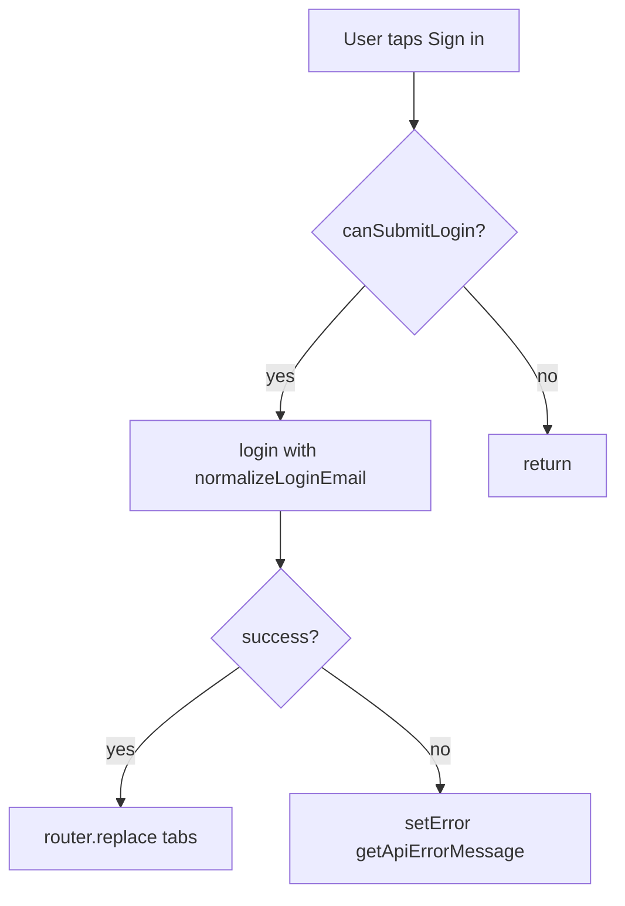

# Login screen (Expo Router) — full spec

## Architecture (use as-is)

- `[context/AuthContext.tsx](c:\Users\AshJo\Documents\GitHub\Clario\apps\mobile\context\AuthContext.tsx)` — `login(email, password)` from `useAuth()`.
- `[services/api.ts](c:\Users\AshJo\Documents\GitHub\Clario\apps\mobile\services\api.ts)` — `getApiErrorMessage(error)` for catch blocks (backend shape `{ error: { message } }`).
- `[utils/loginForm.ts](c:\Users\AshJo\Documents\GitHub\Clario\apps\mobile\utils\loginForm.ts)` — `normalizeLoginEmail`, `canSubmitLogin`.
- `[styles/theme.ts](c:\Users\AshJo\Documents\GitHub\Clario\apps\mobile\styles\theme.ts)` — spacing, colors, typography, radius, shadows.

No changes to `AuthContext` or `api.ts` unless a real gap appears during implementation.

## Scope

- **Primary:** `[apps/mobile/app/(auth)/login.tsx](c:\Users\AshJo\Documents\GitHub\Clario\apps\mobile\app\(auth)`\login.tsx) — complete replacement of the placeholder.
- **Theme:** add `colors.error` (e.g. `#DC2626`) for error copy; optionally `radius.input` (12) if not inlined, to keep input corner radius consistent (12–16px per spec).

---

## Functional requirements

### State

- `email` — string  
- `password` — string  
- `loading` — boolean  
- `error` — `string | null`

### Behavior

1. On submit: if `!canSubmitLogin(email, password)`, return immediately (no API call, do not toggle loading for a no-op submit).
2. Otherwise:
  - `setError(null)` before request (optional but avoids stale errors).
  - `setLoading(true)`.
  - `const trimmedEmail = normalizeLoginEmail(email)` then `await login(trimmedEmail, password)` from `useAuth()`.
  - **Success:** `router.replace("/(tabs)")` via `useRouter()` from `expo-router`.
  - **Error:** `setError(getApiErrorMessage(e))` in `catch`.
  - **Always:** `setLoading(false)` in `finally`.

---

## UI design (layout and hierarchy)

- **Screen:** full screen, `[colors.background](theme)` (neutral).
- **Content:** vertically centered when space allows; use scroll so content is never clipped (see UX).
- **Card container:**
  - `colors.surface` (white)
  - `borderRadius: radius.card` (16px)
  - `shadows.card`
  - Padding **24px** (`spacing.xl`)
  - **Max width** constraint (e.g. 400 or ~90–92% of screen width) for large phones/tablets, centered horizontally.

### Inside the card (order)

1. **App name** — large heading (`typography.heading`), e.g. “Clario”.
2. **Subtitle** — smaller, muted (`colors.textMuted`, can use slightly reduced `fontSize` vs body).
3. **Email** `TextInput`.
4. **Password** `TextInput`.
5. **Error message** (only if `error`) — **above the primary button** (see Error handling).
6. **Primary button** — “Sign in” (or equivalent).
7. **Register link** — “Create account” style text button → `router.push("/(auth)/register")`.

---

## Input design

- Approx. **48px** height.
- Corner radius **12–16px** (theme `radius.input` or `radius.card`).
- Light border: `borderWidth: 1`, `colors.border`.
- Horizontal padding comfortable (`spacing.lg` or similar).
- Vertical spacing between email and password (`marginBottom` on email field).

---

## Button design

- **Full width** within the card.
- Height ~**48px**.
- Rounded corners (match inputs or `radius.card`).
- Background `**colors.accent`**; use `colors.accentPressed` or opacity for pressed state if using `Pressable`.
- **Disabled** when `!canSubmitLogin(email, password)` **or** while `loading` (visual: reduced opacity, `disabled` prop).
- While **loading:** show `**ActivityIndicator`** in the button (e.g. replace label or show spinner + shortened text); keep ~48px touch target.

---

## Error handling

- Render error **above the login button**, below password field.
- Style: **red** text via `colors.error` from theme; **small but readable** (e.g. `fontSize` 13–14, `lineHeight` ~18); margin above button for spacing.
- Clear or overwrite on the next successful submit attempt.

---

## UX details

- `**KeyboardAvoidingView`** — iOS: typically `behavior="padding"` with sensible `keyboardVerticalOffset` (status bar / header); Android often `undefined` or platform-specific.
- `**ScrollView**` — `keyboardShouldPersistTaps="handled"`, `contentContainerStyle` with `flexGrow: 1` and centered content so short screens scroll when the keyboard is open.
- **Dismiss keyboard:** `TouchableWithoutFeedback` or outer `Pressable` calling `Keyboard.dismiss` when tapping outside inputs (or `keyboardShouldPersistTaps` + tap gesture).
- **Accessibility:** `accessibilityLabel` / `accessibilityHint` on inputs and primary button; minimum ~44–48px touch targets; optional `accessibilityLiveRegion` for error text on Android.

---

## Navigation

- **Create account:** text link / `Pressable` → `router.push("/(auth)/register")`.

---

## Code requirements

- Single **functional** component.
- `**StyleSheet.create`** — no messy long inline objects; map colors/spacing from **theme** imports.
- Readable structure: handlers (`onSubmit`), small style object at bottom of file.
- Reuse **theme** values throughout (`colors`, `spacing`, `typography`, `radius`, `shadows`).

---

## Verification

- Empty or whitespace-only email / empty password: submit disabled or no-op; no API call.
- Bad credentials: API message surfaced via `getApiErrorMessage`.
- Success: lands on tab shell (`/(tabs)`).
- Keyboard + scroll + dismiss behave on a small simulator.

---

## Output

- Complete, production-ready `[login.tsx](c:\Users\AshJo\Documents\GitHub\Clario\apps\mobile\app\(auth)`\login.tsx) (plus minimal theme additions if `colors.error` / `radius.input` are added).

