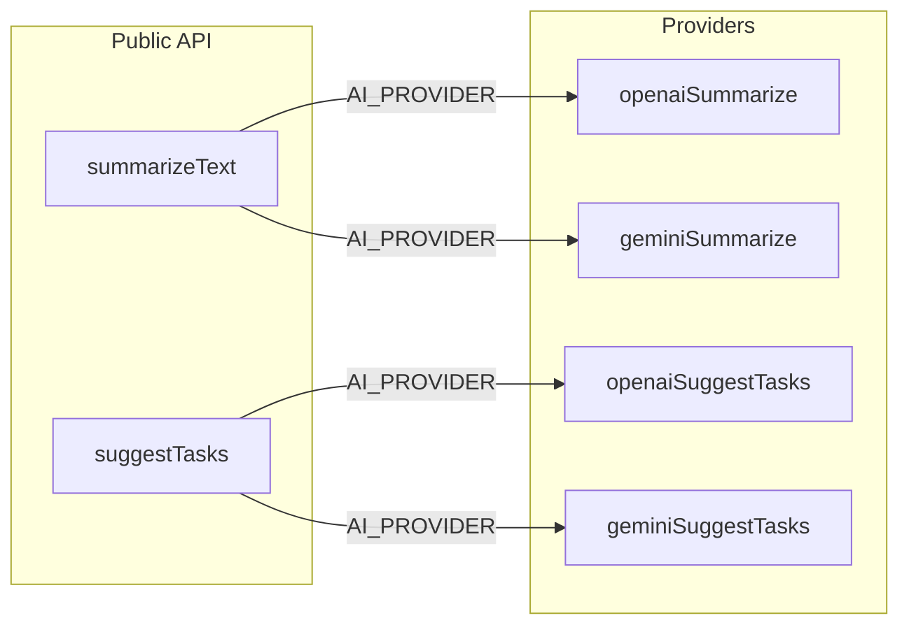

# Multi-provider AI (OpenAI + Gemini)

## 1. Dependencies

- Add `**@google/generative-ai**` to `[apps/api/package.json](c:\Users\AshJo\Documents\GitHub\Clario\apps\api\package.json)` (official SDK; matches “SDK or REST”).

## 2. Environment schema (`[apps/api/src/config/env.ts](c:\Users\AshJo\Documents\GitHub\Clario\apps\api\src\config\env.ts)`)

- Add:
  - `AI_PROVIDER`: `z.enum(["openai", "gemini"]).default("openai")`
  - `GEMINI_API_KEY`: `z.string().optional()` (treat empty string as unset)
  - `GEMINI_MODEL`: `z.string().min(1).default("gemini-1.5-flash")`
- Relax `**OPENAI_API_KEY**` to optional at the field level so Gemini-only configs validate.
- Use `**superRefine**` (or equivalent) so that:
  - When `AI_PROVIDER === "openai"`, `OPENAI_API_KEY` is required (non-empty).
  - When `AI_PROVIDER === "gemini"`, `GEMINI_API_KEY` is required (non-empty).

This avoids breaking deploys that only set keys for the active provider.

## 3. `.env.example` (`[apps/api/.env.example](c:\Users\AshJo\Documents\GitHub\Clario\apps\api\.env.example)`)

- Document `AI_PROVIDER=openai` (default), `GEMINI_API_KEY` (optional / required when using Gemini), `GEMINI_MODEL=gemini-1.5-flash`, and clarify OpenAI vs Gemini blocks.

## 4. Refactor `[apps/api/src/services/ai.service.ts](c:\Users\AshJo\Documents\GitHub\Clario\apps\api\src\services\ai.service.ts)`

**Keep shared behavior** (unchanged semantics):

- `sanitizeInput`, `normalizeSummaryOutput`, `normalizeSuggestionList`, `parseSuggestionsFromText`, `logAi`, constants (`MAX_SUMMARY_TOKENS`, `MAX_SUGGEST_TOKENS`, `MAX_SUGGESTIONS`, `FALLBACK_TEXT`).

**OpenAI**

- Move current completion logic into `**openaiSummarize(text: string)`** and `**openaiSuggestTasks(text: string)**` using `env.OPENAI_MODEL`, `max_tokens` as today, and existing `**mapOpenAIError**` (unchanged mapping).
- Instantiate `**OpenAI**` lazily inside these functions (or behind a small getter) so a missing OpenAI key does not crash module load when the app runs as Gemini-only.

**Gemini**

- Implement `**geminiSummarize`** / `**geminiSuggestTasks**` with `GoogleGenerativeAI` + `getGenerativeModel({ model: env.GEMINI_MODEL, generationConfig: { maxOutputTokens: … } })`:
  - Summarize: system-style instruction + user text; plain text output; reuse `normalizeSummaryOutput`.
  - Suggest: prompt for JSON array of strings; pass result through existing `parseSuggestionsFromText` + empty-array fallback to single trimmed string (same as OpenAI path).
- Add `**mapGeminiError**`: inspect SDK/HTTP-style errors (status / message / codes) and map to the same **user-facing** outcomes as OpenAI: rate limit → **429** `RATE_LIMIT`, network/timeout → **503** `AI_UNAVAILABLE`, else **503** `AI_ERROR` / `AI processing error` — **never** attach raw API bodies to `HttpError` messages.

**Public API**

- `summarizeText` / `suggestTasks`: after `sanitizeInput`, branch:

```ts
if (env.AI_PROVIDER === "gemini") {
  return geminiSummarize(input);
} else {
  return openaiSummarize(input);
}
```

(same pattern for `suggestTasks`).

**Optional fallback (bonus)**

- Wrap primary call in `try/catch`; on failure, if the **other** provider’s key is present and distinct from the failing path, call the alternate `*Summarize` / `*SuggestTasks` once. If both fail, throw the **last** normalized error (or first — pick one and document in code briefly). If only one key exists, skip fallback.

## 5. Note summary model (`[apps/api/src/services/note.service.ts](c:\Users\AshJo\Documents\GitHub\Clario\apps\api\src\services\note.service.ts)`)

- Replace `summaryModel: env.OPENAI_MODEL` with a ternary on `env.AI_PROVIDER` → `env.GEMINI_MODEL` vs `env.OPENAI_MODEL` so stored metadata matches the provider. **Routes stay untouched** (per your constraint).

## 6. Verification

- `npm run build` in `apps/api` (TypeScript compile).
- Smoke: `summarizeText` / `suggestTasks` with `AI_PROVIDER=openai` and `gemini` (if keys available).




